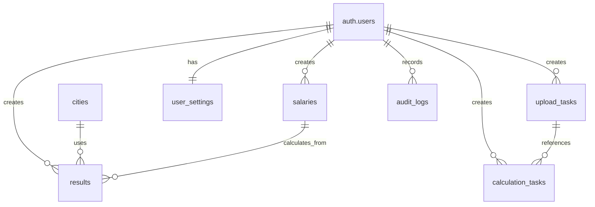

# Supabase 数据库部署指南

本目录包含五险一金计算器项目的数据库 Schema 和配置文件。

## 📁 文件结构

```
supabase/
├── migrations/
│   ├── 001_create_tables.sql      # 数据库表结构
│   └── 002_initial_data.sql       # 初始数据
├── policies/
│   └── rls.sql                    # Row Level Security 策略
└── README.md                      # 本文档
```

## 🚀 部署步骤

### 1. 创建 Supabase 项目

1. 访问 [Supabase 官网](https://supabase.com)
2. 创建新项目
3. 记录项目的 URL 和 API 密钥

### 2. 配置环境变量

在项目根目录的 `.env.local` 文件中添加：

```env
# Supabase 配置
NEXT_PUBLIC_SUPABASE_URL=your_supabase_project_url
NEXT_PUBLIC_SUPABASE_ANON_KEY=your_supabase_anon_key
SUPABASE_SERVICE_ROLE_KEY=your_supabase_service_role_key
```

### 3. 执行数据库迁移

#### 方法一：使用 Supabase Dashboard

1. 登录 Supabase Dashboard
2. 进入 **SQL Editor**
3. 依次执行以下 SQL 文件：

```sql
-- 执行表结构创建
-- 复制 supabase/migrations/001_create_tables.sql 的内容并执行

-- 执行初始数据插入
-- 复制 supabase/migrations/002_initial_data.sql 的内容并执行

-- 执行 RLS 策略配置
-- 复制 supabase/policies/rls.sql 的内容并执行
```

#### 方法二：使用 Supabase CLI（推荐）

1. 安装 Supabase CLI：
```bash
npm install -g supabase
```

2. 登录 Supabase：
```bash
supabase login
```

3. 链接到项目：
```bash
supabase link --project-ref your_project_ref
```

4. 执行迁移：
```bash
supabase db push
```

### 4. 验证部署

#### 检查表结构

```sql
-- 查看所有表
SELECT table_name, table_type
FROM information_schema.tables
WHERE table_schema = 'public'
ORDER BY table_name;
```

#### 检查 RLS 策略

```sql
-- 查看 RLS 状态
SELECT schemaname, tablename, rowsecurity
FROM pg_tables
WHERE schemaname = 'public' AND rowsecurity = true;
```

#### 检查初始数据

```sql
-- 查看城市社保标准
SELECT * FROM cities ORDER BY city_name, year;
```

### 5. 配置 Auth

1. 在 Supabase Dashboard 中进入 **Authentication** > **Settings**
2. 配置以下设置：
   - **Site URL**: `http://localhost:3000` (开发环境)
   - **Redirect URLs**: `http://localhost:3000/auth/callback`
   - 启用 **Email/Password** 认证方式

## 📊 数据库表说明

### 主要表结构

| 表名 | 说明 | 主要字段 |
|------|------|----------|
| `cities` | 城市社保标准 | `city_name`, `year`, `base_min`, `base_max`, 各项缴费比例 |
| `salaries` | 员工工资数据 | `employee_id`, `employee_name`, `year_month`, `salary_amount` |
| `results` | 计算结果 | `employee_name`, `avg_salary`, `contribution_base`, 各项缴费金额 |
| `upload_tasks` | 上传任务记录 | `task_name`, `file_name`, `status`, `total_rows`, `processed_rows` |
| `calculation_tasks` | 计算任务记录 | `task_name`, `status`, `total_employees`, `processed_employees` |
| `user_settings` | 用户配置 | `default_city`, `default_year`, `theme`, `language` |

### 数据关系图



## 🔒 安全配置

### Row Level Security (RLS)

所有用户数据表都启用了 RLS，确保：
- 用户只能访问自己的数据
- 城市标准数据对所有认证用户可读
- 审计日志记录所有数据变更

### 权限策略

| 表 | 读取权限 | 写入权限 | 说明 |
|----|----------|----------|------|
| `cities` | 公开 | 认证用户 | 社保标准为公共数据 |
| `salaries` | 创建者 | 创建者 | 工资数据隔离 |
| `results` | 创建者 | 创建者 | 计算结果隔离 |
| `upload_tasks` | 创建者 | 创建者 | 上传任务隔离 |
| `calculation_tasks` | 创建者 | 创建者 | 计算任务隔离 |
| `user_settings` | 所有者 | 所有者 | 用户配置隔离 |

## 📈 性能优化

### 索引策略

- **主键索引**：所有表的 `id` 字段
- **外键索引**：所有 `created_by`, `user_id` 等外键字段
- **复合索引**：常用查询组合字段
- **业务索引**：`employee_name`, `year_month` 等业务字段

### 查询优化

- 使用视图简化复杂查询
- 预计算常用汇总数据
- 分页查询避免全表扫描

## 🛠 维护操作

### 数据清理

```sql
-- 清理6个月前的审计日志
SELECT cleanup_old_audit_logs();

-- 清理软删除数据
SELECT cleanup_deleted_data();
```

### 数据备份

```sql
-- 导出用户数据
SELECT * FROM salaries WHERE created_by = 'user_uuid';

-- 导出计算结果
SELECT * FROM results WHERE created_by = 'user_uuid';
```

### 性能监控

```sql
-- 查看表大小
SELECT
    schemaname,
    tablename,
    pg_size_pretty(pg_total_relation_size(schemaname||'.'||tablename)) as size
FROM pg_tables
WHERE schemaname = 'public'
ORDER BY pg_total_relation_size(schemaname||'.'||tablename) DESC;

-- 查看索引使用情况
SELECT
    schemaname,
    tablename,
    indexname,
    idx_scan,
    idx_tup_read,
    idx_tup_fetch
FROM pg_stat_user_indexes
ORDER BY idx_scan DESC;
```

## 🔄 数据迁移

### 版本升级

1. 创建新的迁移文件：`003_upgrade.sql`
2. 在新文件中添加升级脚本
3. 执行迁移：`supabase db push`

### 数据导入导出

```sql
-- 导出数据
COPY salaries TO '/tmp/salaries.csv' WITH CSV HEADER;

-- 导入数据
COPY salaries FROM '/tmp/salaries.csv' WITH CSV HEADER;
```

## 🐛 故障排除

### 常见问题

1. **RLS 策略阻止查询**
   ```sql
   -- 临时禁用 RLS 进行调试
   ALTER TABLE salaries DISABLE ROW LEVEL SECURITY;
   ```

2. **权限问题**
   ```sql
   -- 检查用户权限
   SELECT * FROM pg_roles WHERE rolname = 'authenticated';
   ```

3. **性能问题**
   ```sql
   -- 查看慢查询
   SELECT query, mean_time, calls
   FROM pg_stat_statements
   ORDER BY mean_time DESC
   LIMIT 10;
   ```

### 日志查看

1. 在 Supabase Dashboard 中查看 **Logs**
2. 使用数据库函数查看审计日志
3. 检查应用日志中的数据库连接错误

## 📞 支持与帮助

- [Supabase 官方文档](https://supabase.com/docs)
- [PostgreSQL 文档](https://www.postgresql.org/docs/)
- 项目 Issues：在 GitHub 上提交问题

---

**最后更新**: 2025-12-22
**版本**: v0.1.0
**维护者**: 五险一金计算器团队